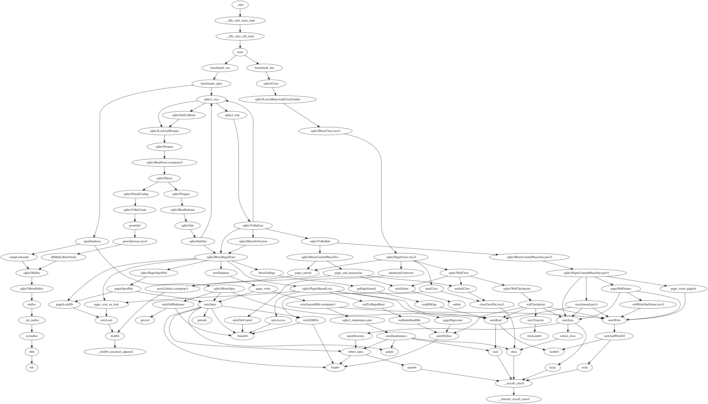
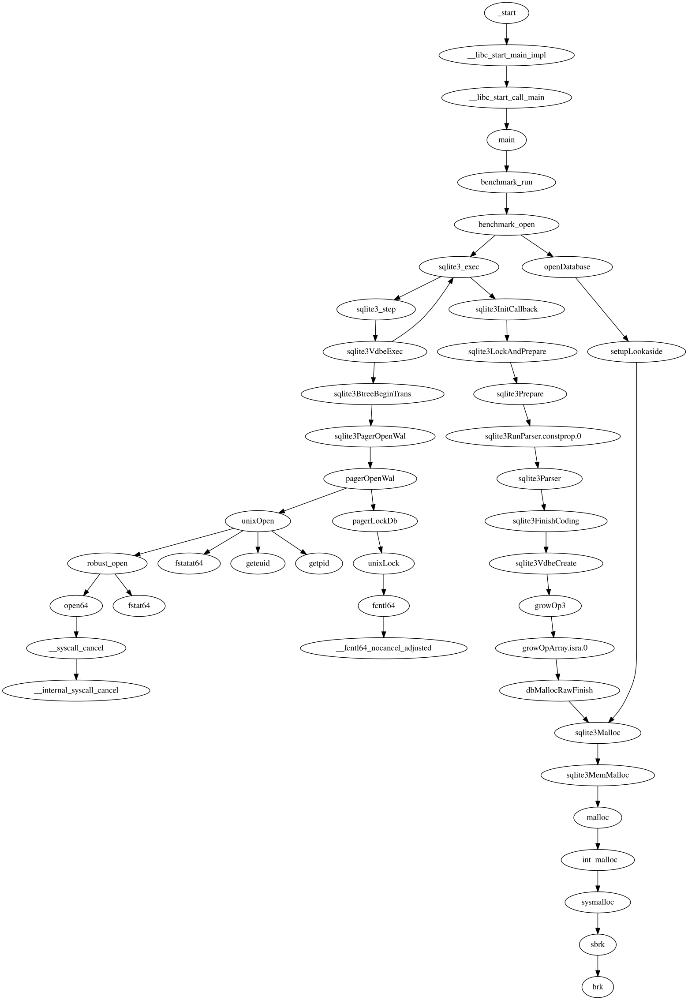
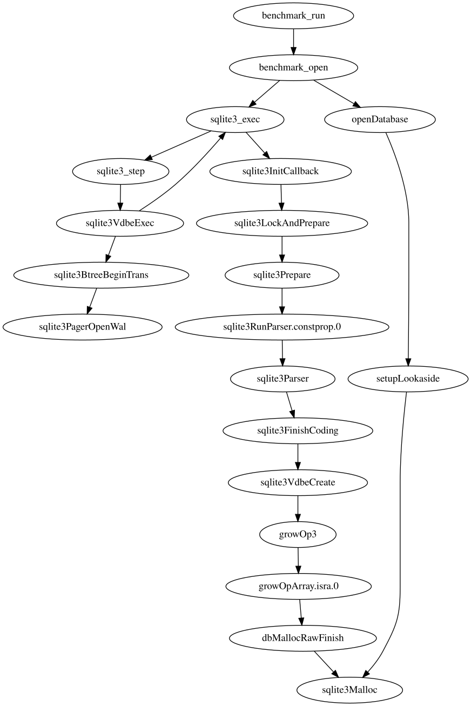
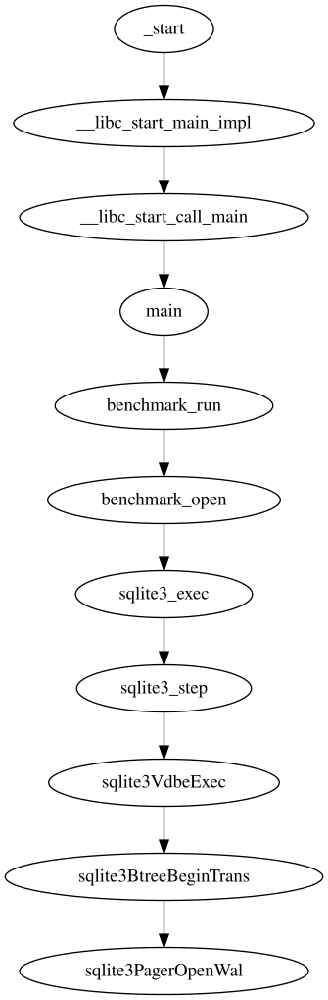
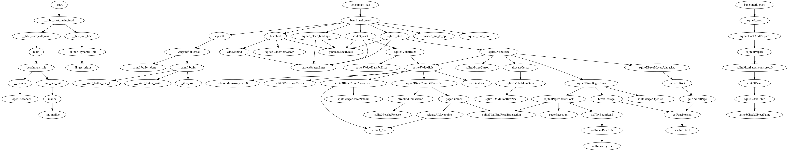
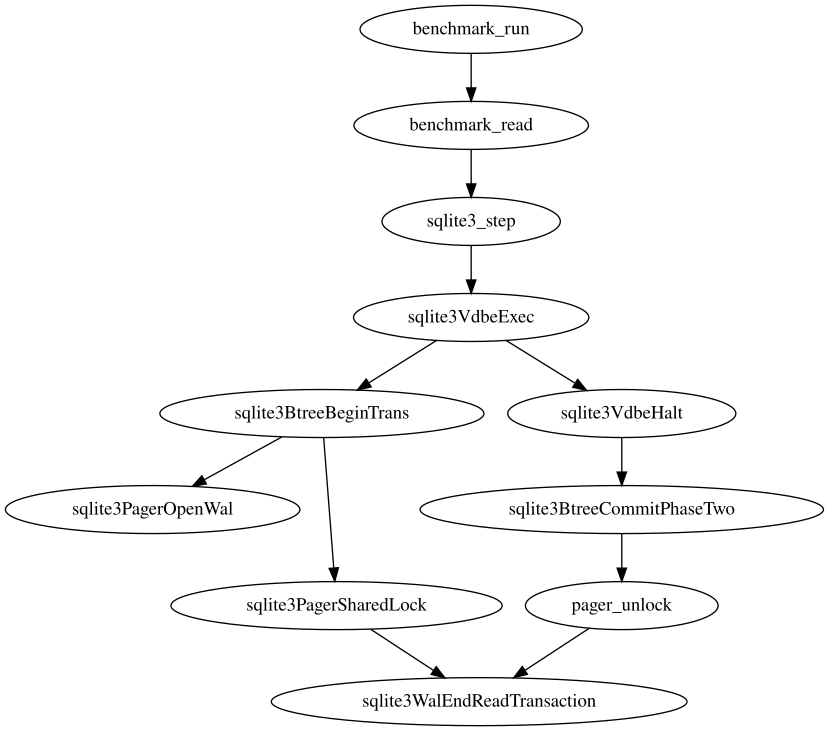
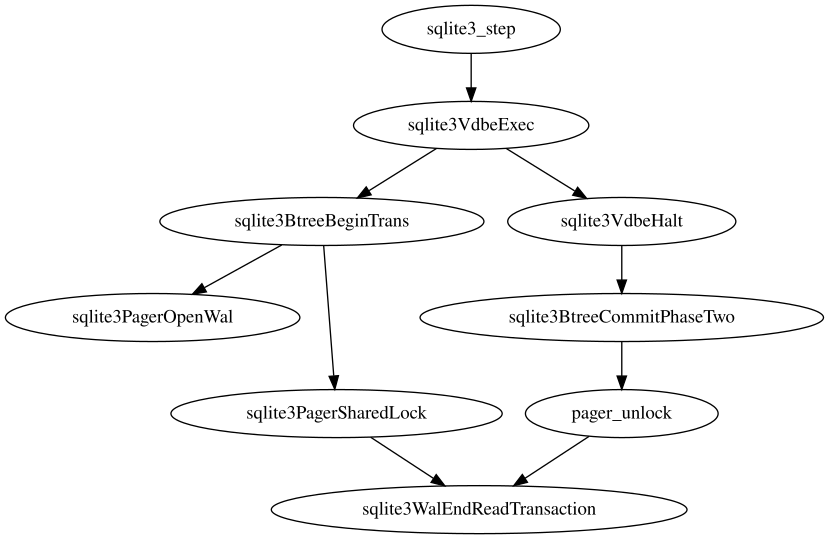
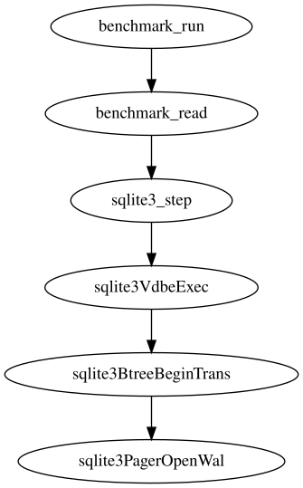
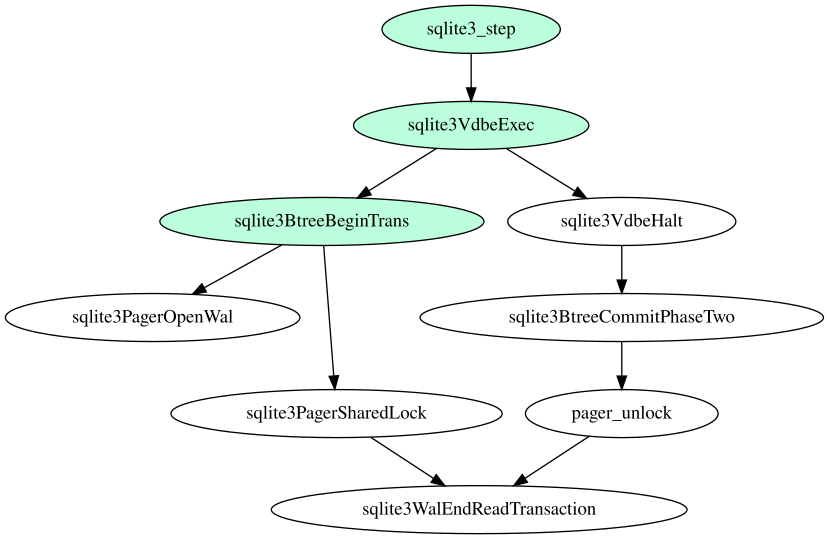

# covlizer

Function subgraph visualization from coverage traces. (WIP)

## Context

We want to identify which functions are relevant to specific execution paths.

It's time-consuming to manually follow call references. Even more so if we want to track function parameters (for disassemblies, it can go as far as each register read/write).

It's also hard to apply static analysis to this problem:

- For source code, we need accurate AST representations (for each language!), or use an intermediate representation like [LLVM IR](https://llvm.org/docs/LangRef.html);
- For disassemblies, we need accurate instruction semantics (how much x86 does your favorite emulator actually support?);
- Dynamic dispatching might not be resolved (e.g. runtime evaluated code, or calls to an address stored in a register);
- Native languages require build system integration to resolve linked dependencies; some tools (like LSPs or [kythe](https://github.com/kythe/kythe)) use [compilation databases](https://clang.llvm.org/docs/JSONCompilationDatabase.html), which in some cases, happen to be [dynamically generated](https://github.com/rizsotto/Bear);

That last point about dynamic analysis happens to be our solution's guiding insight: **Collecting stacktraces is cheap.** These are plaintext lists. These have the same format for any high-level language. If we want to analyze disassemblies, then we can collect start addresses of each covered basic block, visualizing at the control-flow level. Still plaintext lists.

So, let's build function graphs from stacktraces. Or subgraphs, if we filter stacktraces containing specific functions.

## Examples

We use [sqlite-bench](https://github.com/ukontainer/sqlite-bench) to generate stacktraces. It's a static binary that executes filesystem I/O.

Stacktraces are stored as JSON files, where keys are frames concatenated with ASCII Unit Separator characters (`0x1f`), and values are the number of occurrences of that sequence of frames.

### GDB

Stacktraces are collected via instrumented profiling, using a debugger that breaks on each system call:

```sh
gdb ./sqlite-bench --command bts.gdb.py
```

Full graph:

```sh
cargo run bts.gdb.json --out-dot=bts.gdb.dot && dot -Tsvg bts.gdb.dot > bts.gdb.svg
```


Full subgraph of paths containing 2 target function names:

```sh
cargo run bts.gdb.json --out-dot=bts.gdb.2funcs.pass.dot \
    --prune=pass --targets=sqlite3Malloc,sqlite3PagerOpenWal && dot -Tsvg bts.gdb.2funcs.pass.dot > bts.gdb.2funcs.pass.svg
```


Pruned subgraph of paths containing 2 target function names:

```sh
cargo run bts.gdb.json --out-dot=bts.gdb.2funcs.dot \
    --prune=all --targets=sqlite3Malloc,sqlite3PagerOpenWal && dot -Tsvg bts.gdb.2funcs.dot > bts.gdb.2funcs.svg
```


Pruned subgraph of paths containing a single target function name:

```sh
cargo run bts.gdb.json --out-dot=bts.gdb.1func.dot \
    --prune=all --targets=sqlite3PagerOpenWal && dot -Tsvg bts.gdb.1func.dot > bts.gdb.1func.svg
```


We can also output a directed acyclic graph equivalent of the pruned subgraph, as a plaintext tree:

```sh
cargo run bts.gdb.json --out-tree --prune=all --targets=sqlite3Malloc,sqlite3PagerOpenWal
```

```
benchmark_run
└─ benchmark_open
   ├─ openDatabase
   │  └─ setupLookaside
   │     └─ sqlite3Malloc
   └─ sqlite3_exec
      ├─ sqlite3InitCallback
      │  └─ sqlite3LockAndPrepare
      │     └─ sqlite3Prepare
      │        └─ sqlite3RunParser.constprop.0
      │           └─ sqlite3Parser
      │              └─ sqlite3FinishCoding
      │                 └─ sqlite3VdbeCreate
      │                    └─ growOp3
      │                       └─ growOpArray.isra.0
      │                          └─ dbMallocRawFinish
      │                             └─ sqlite3Malloc
      └─ sqlite3_step
         └─ sqlite3VdbeExec
            └─ sqlite3BtreeBeginTrans
               └─ sqlite3PagerOpenWal
```

### perf

Stacktraces are collected via sampled profiling, using [perf events](https://git.kernel.org/pub/scm/linux/kernel/git/torvalds/linux.git/tree/tools/perf/Documentation/perf-record.txt) that include call-graph recording (more complete results were obtained using Hardware Last Branch Records a.k.a. lbr):

```sh
sudo sysctl kernel.perf_event_paranoid=1
sudo sysctl kernel.kptr_restrict=0
perf record -F 999 --call-graph lbr ~/opt/sqlite-bench/sqlite-bench --benchmarks=readseq
perf report -D | ./bts.perf.py
```

Full graph (note that multiple root nodes can exist due to excluded frame addresses not matching debuginfo):

```sh
cargo run bts.perf.json --out-dot=bts.perf.dot && dot -Tsvg bts.perf.dot > bts.perf.svg
```


Full subgraph of paths containing 2 target function names:

```sh
cargo run bts.perf.json --out-dot=bts.perf.2funcs.pass.dot \
    --prune=pass --targets=sqlite3WalEndReadTransaction,sqlite3PagerOpenWal && dot -Tsvg bts.perf.2funcs.pass.dot > bts.perf.2funcs.pass.svg
```


Pruned subgraph of paths containing 2 target function names:

```sh
cargo run bts.perf.json --out-dot=bts.perf.2funcs.dot \
    --prune=all --targets=sqlite3WalEndReadTransaction,sqlite3PagerOpenWal && dot -Tsvg bts.perf.2funcs.dot > bts.perf.2funcs.svg
```


Pruned subgraph of paths containing a single target function name:

```sh
cargo run bts.perf.json --out-dot=bts.perf.1func.dot \
    --prune=all --targets=sqlite3PagerOpenWal && dot -Tsvg bts.perf.1func.dot > bts.perf.1func.svg
```


#### Coverage analysis

We can also pass a second input file, comparing its frames against the reference graph built from the first input file. Covered frames will be highlighted in the output graph.

Pruned subgraph of paths containing 2 target function names:

```sh
perf record -F 1 --call-graph lbr ~/opt/sqlite-bench/sqlite-bench --benchmarks=readseq
perf report -D | ./bts.perf.py # Renamed as `bts.perf.f1.json`

cargo run bts.perf.json bts.perf.f1.json --out-dot=bts.perf.f1.2funcs.dot \
   --prune=all --targets=sqlite3WalEndReadTransaction,sqlite3PagerOpenWal && dot -Tsvg bts.perf.f1.2funcs.dot > bts.perf.f1.2funcs.svg
```


### bpftrace

Stacktraces are collected via instrumented profiling, using eBPF [user probes](https://bpftrace.org/hol/user-probes):

```sh
./tracer.sh
```

Unfortunately, frames seem to be incorrectly parsed, and the internal ring buffer can't keep up with events from 100 probes:

```
        sqlite3BtreeBeginTrans+0
        0x3839393939393030
\n
        sqlite3CollapseDatabaseArray+0
        0
        0x6500797261726f70
\nLost 6377405 events
```

Similar results are observed with strace:

```sh
strace -k -f -e file ./sqlite-bench --benchmarks=readseq
```
```
> sqlite-bench(fstatat+0xa) [0x12dcba]
> unexpected_backtracing_error [0x558d3000000000]
```

Perhaps a rabbit hole to be followed...

## TODO

- Include metadata: Function parameter / variable values (grouped-by distinct visited paths?);
- More input formats: eBPF via bpftrace; language-specific function call parsers;
- More output formats: Prefer simpler graph layouts like [iongraph](https://spidermonkey.dev/blog/2025/10/28/iongraph-web.html);
- Reduce output clutter: Nodes with a single child can be collapsed into a single multi-line node;
